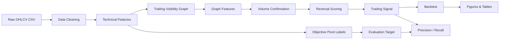

# NSSS Visibility Graph Turning Points

A Python project for **reversal-zone detection** on `NSSS.JK` using:

1. **OHLCV data**
2. **Price-time geometry**
3. **Trailing visibility graph features**
4. **Volume confirmation**
5. **Transparent reversal scoring**
6. **Walk-forward validation**
7. **Rule-based backtesting**
8. **Visual reports**

> The project does **not** try to predict tomorrow's exact price.  
> It detects zones where the price structure, graph shape, and volume confirmation suggest a possible turning point.

---

## Research Question

Can a trailing price-time visibility graph, combined with volume confirmation and fundamental catalyst context, detect potential reversal zones in `NSSS.JK` without look-ahead leakage?

---

## Project Context

`NSSS.JK` is framed as a palm-oil sector case study because the stock has:

- exposure to an upstream palm-oil business,
- sector catalyst context from B40/B50 and CPO demand,
- a turnaround-style fundamental narrative,
- high volatility, which provides enough turning-point events for testing.

The fundamental context is kept as a configurable score in `config/config.yaml`. It is **not** used as a hidden black-box predictor. You can adjust it as new financial statements or sector assumptions arrive.

---

## Pipeline



Horizontal flow:

```text
OHLCV Data → Data Cleaning → Price-Time Mapping → Trend Detection
→ Pivot Detection → Support/Resistance Zone → Volume Confirmation
→ Visibility Graph Features → Reversal Score → Trading Signal
→ Backtesting → Performance Evaluation
```

---

## Why Visibility Graph?

A price chart is treated as a geometric object in a Cartesian plane:

- X-axis = time
- Y-axis = price
- a rolling window = one object
- the visibility graph captures which price bars can "see" each other

The key hypothesis:

> Local extrema and structural turning points tend to appear as graph hubs or unusual nodes.

This repo uses a **trailing window only**. For each date `t`, the graph is built from:

```text
[t - window + 1, ..., t]
```

No future bars are used as features.

---

## Repository Structure

```text
nsss-vg-turning-points/
├── README.md
├── requirements.txt
├── pyproject.toml
├── Makefile
├── config/
│   └── config.yaml
├── data/
│   ├── raw/
│   │   └── NSSS_stock_history.csv
│   ├── interim/
│   └── processed/
├── reports/
│   ├── figures/
│   ├── tables/
│   └── logs/
├── src/
│   └── nsss_vg/
│       ├── data/
│       ├── labeling/
│       ├── graph/
│       ├── models/
│       ├── evaluation/
│       └── viz/
├── scripts/
│   ├── run_pipeline.py
│   └── download_data.py
├── app/
│   └── streamlit_app.py
└── tests/
```

---

## Installation

```bash
python -m venv .venv
# Windows
.venv\Scripts\activate

# macOS/Linux
source .venv/bin/activate

pip install -r requirements.txt
```

---

## Run Pipeline

```bash
python scripts/run_pipeline.py --config config/config.yaml
```

Or:

```bash
make run
```

---

## Optional Dashboard

```bash
pip install streamlit
streamlit run app/streamlit_app.py
```

---

## Outputs

After running the pipeline:

### Processed Data

```text
data/processed/01_clean_ohlcv.csv
data/processed/02_technical_features.csv
data/processed/03_labels.csv
data/processed/04_visibility_features.csv
data/processed/05_reversal_signals.csv
```

### Tables

```text
reports/tables/backtest_trades.csv
reports/tables/backtest_summary.csv
reports/tables/equity_curve.csv
reports/tables/rule_based_metrics.csv
reports/tables/rf_walk_forward_metrics.csv
reports/tables/rf_predictions.csv
```

### Figures

```text
reports/figures/01_price_signals.png
reports/figures/02_volume_confirmation.png
reports/figures/03_reversal_score_timeline.png
reports/figures/04_visibility_graph_features.png
reports/figures/05_visibility_graph_example.png
reports/figures/06_backtest_equity_curve.png
reports/figures/07_backtest_drawdown.png
```

---

## Main Scoring Formula

```text
Technical Score =
Support Score
+ Slope Score
+ Slope Recovery Score
+ Pivot Candidate Score
+ Volume Score
+ Momentum Score
+ Visibility Graph Hub Score
+ Visibility Graph Breakout Score
```

Signal label:

```text
Technical Score < 3  → No Signal
Technical Score = 3  → Watchlist
Technical Score = 4  → Potential Reversal
Technical Score ≥ 5  → Strong Reversal
```

The separate `FundamentalScore` is retained as project context. It can be used for ranking or narrative framing, but the default signal threshold is based on technical/graph evidence.

---

## No-Look-Ahead Rule

Features are computed from trailing data only. Future bars are used only for labels and evaluation.

This avoids the common visibility-graph leakage trap: building a graph with future candles and then pretending the current node feature was available in real time.

---

## Educational Disclaimer

This project is for quantitative research, learning, and portfolio demonstration. It is not investment advice and does not guarantee trading performance.
